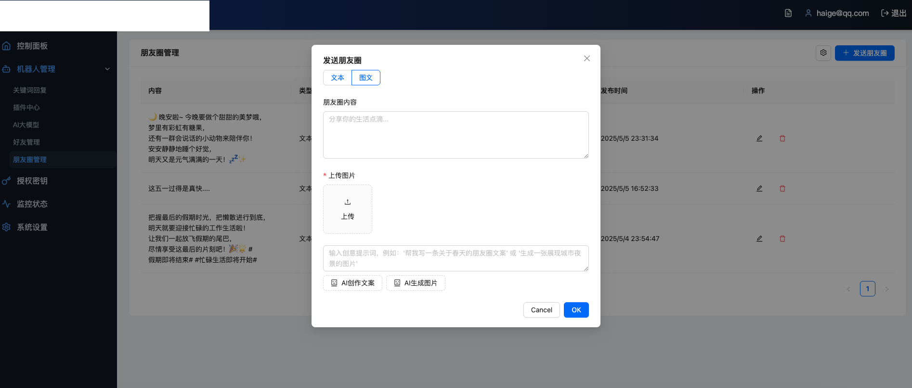
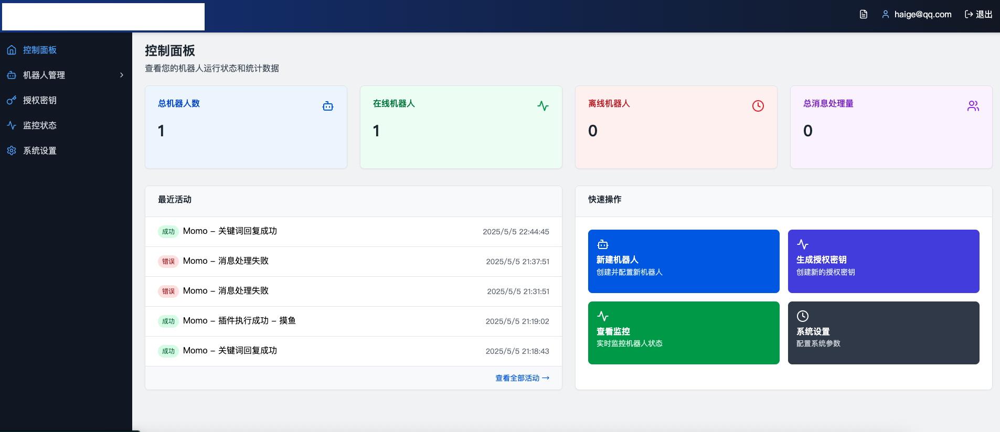
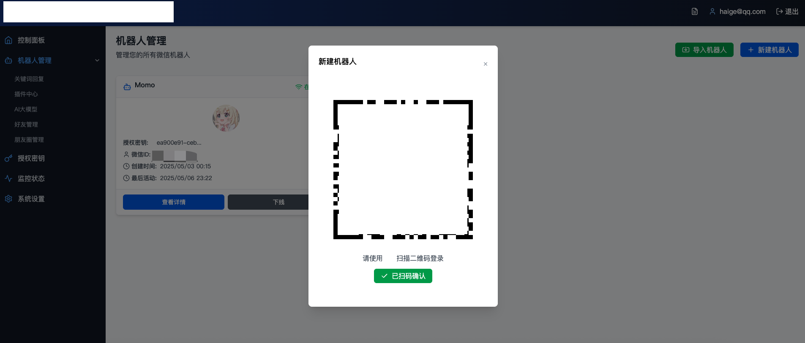
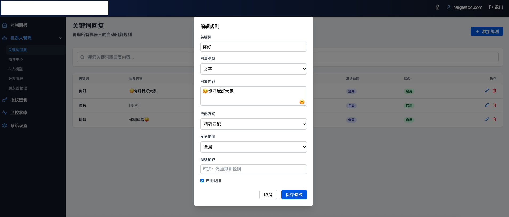
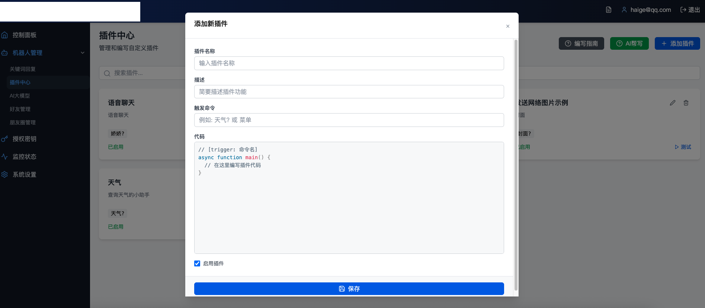

# bot_web

## 简介
这是一个前后端分离的项目（适配855）。后端使用 Node.js。前端代码位于项目录，后端代码在server里。该项目使用 Supabase 作为数据库//免费的，也可以私有化部署。
有能力的二开吧，因工作时间有限，实在没时间开发了...
记得全局搜索"https://855部署的地址"替换自己的855地址！
## 部署文档

### 部署效果展示







### 1. 注册 Supabase
1.  访问 [Supabase 官网](https://supabase.io/)。
2.  点击 "Start your project" 按钮。
3.  注册一个新账户或使用现有账户登录。
4.  创建一个新的项目，填写项目名称并**妥善保管数据库密码**。
5.  项目创建完成后，在项目设置的 API 部分，记下项目的 **URL** 和 **anon public Key**。这两项是后续配置所必需的。

### 2. 导入数据库
1.  在 Supabase 控制台中，进入您创建的项目。
2.  在左侧导航栏中，选择 "Table Editor" (表格编辑器) 或 "SQL Editor" (SQL 编辑器)。
3.  如果使用 SQL 编辑器：
    *   点击 "+ New query" (+ 新建查询) 或找到已有的查询窗口。
    *   将您的数据库结构在/supabase文件里。
    *   点击 "RUN" 执行。
4.  如果使用表格编辑器，可以手动创建表结构或通过 CSV 等方式导入数据。
5.  检查表和数据是否已成功导入。

### 3. 部署后端 (`/server`)
1.  **安装依赖**:
    打开终端，进入后端项目目录：
    ```bash
    cd xx/server
    npm install
    ```
2.  **配置环境变量**:
    在 `/server` 目录下创建一个名为 `.env` 的文件。
    文件内容应如下，请替换为你从 Supabase 获取到的真实值：
    ```env
    SUPABASE_URL=你的Supabase项目URL
    SUPABASE_KEY=你的Supabase_anon_public_Key
    SUPABASE_SERVICE_ROLE_KEY==你的SUPABASE_SERVICE_ROLE_KEY
    ```
3.  **启动后端服务**:
    在 `/server` 目录下，运行：
    ```bash
    node wss-service.js
    ```
    启动

### 4. 部署前端

1.  **安装依赖**:
    在直接在根目录下，执行 ：
    ```bash
    npm install
    ```
2.  **配置环境变量**:
    ```env
    SUPABASE_URL=你的Supabase项目URL
    SUPABASE_KEY=你的Supabase_anon_public_Key
4.  **构建前端应用 (用于生产环境)**:
    ```bash
    npm run build
    ```
    构建后的静态文件通常位于  `dist` 目录。
5.  **启动前端开发服务**:
    ```bash
    npm start
    ```
    对于生产部署，你需要将步骤 4 中构建的静态文件部署到静态文件托管服务或配置 Nginx/Apache 等 Web 服务器指向该静态文件目录。

## 其他说明
-   确保你已安装最新 Node.js 和 npm 
-   后端依赖项在 `server/package.json` 中定义。
-   Supabase 的免费套餐有使用限制，请根据项目需求评估是否需要升级或者自己私有化部署。
